# OpenAI: Ejercicios y asistentes con Angular + NestJS

- This documents follows the [OpenAI: Ejercicios y asistentes con Angular + NestJS](https://www.udemy.com/course/angular-nest-openai/) Udemy Course

## 1. Creating the public repository on GitHub

### 1.1. Creating the public repository on GitHub

- We are going to create the `angular-nestjs-openai` repository on GitHub

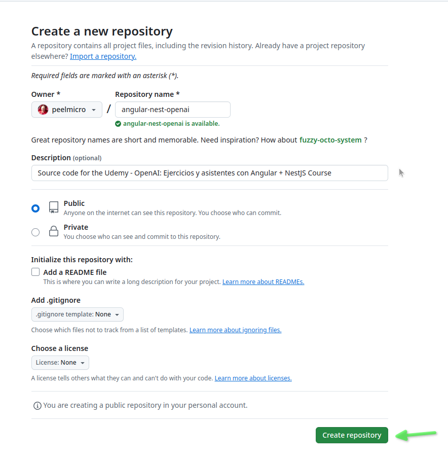

- We can see it has been created

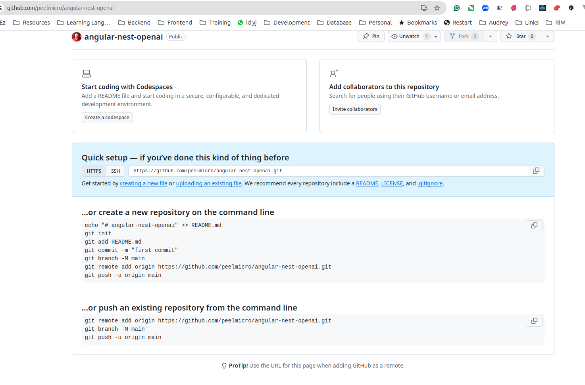

### 1.2. Cloning the repository

- We can clone the repository

```bash
git clone https://github.com/peelmicro/angular-nest-openai.git
Cloning into 'angular-nest-openai'...
warning: You appear to have cloned an empty repository.
```

### 1.3. Creating the `README.md` file

- We are going to create the initial `README.md` file con the following content:

```markdown
# angular-nestjs-openai

OpenAI Course with Angular + NestJS based on the Udemy Course [OpenAI: Ejercicios y asistentes con Angular + NestJS](https://www.udemy.com/course/angular-nest-openai/). You can follow the course on Udemy.

## Getting Started

- After cloning the repo.
  - Go to `api` folder and execute `yarn` to install the dependencies.
  - Go to `web` folder and execute `yarn` to install the dependencies.

## Running the app

- Go to `api` folder and execute `yarn start:dev` to start the api server.
- Go to `web` folder and execute `yarn start` to start the client server.
```

## 2. Creating the API NestJS project

### 2.1. Installing the NestJS CLI and Yarn CLI globally

- We are going to create the API NestJS project by using the NestJS CLI.
- We need to have the latest version of the NestJS CLI installed globally, by executing `npm i -g @nestjs/cli`.
- If we are using `nvm` we could execute `nvm install lts` to install the latest ltse version of node and every time we create a new terminal window we could execute `nvm use --lts` to use the latest stable version of node.
- Please, notice that every time we install a global package it is installed in the current version of node we are using.

```bash
nvm use --lts
Now using node v20.18.0 (npm v10.8.2)
juanpabloperez@jpp-PROX15-AMD:~/Training/AngularNestJS$ npm i -g @nestjs/cli

added 258 packages in 7s

53 packages are looking for funding
  run `npm fund` for details
juanpabloperez@jpp-PROX15-AMD:~/Training/AngularNestJS$ nest -v
10.4.5
```

- We are going to use the latest version of yarn, so we need to install or update it by executing `npm i -g yarn`.

```bash
npm i -g yarn

added 1 package in 585ms
juanpabloperez@jpp-PROX15-AMD:~/Training/AngularNestJS$ yarn -v
1.22.22
```

### 2.2. Creating the API NestJS project

- As we have already created the repository in github we need to execute the following command to create the NestJS API, using `yarn` and avoid the creation of the git repository.
- `--skip-git` is used to avoid creating a git repository, as we are going to use the current repository.
- `--package-manager=yarn` is used to specify that we are going to use yarn as the package manager.

```bash
juanpabloperez@jpp-PROX15-AMD:~/Training/AngularNestJS/angular-nest-openai$ nest new api --package-manager=yarn --strict --skip-git
⚡  We will scaffold your app in a few seconds..

CREATE api/.eslintrc.js (663 bytes)
CREATE api/.prettierrc (51 bytes)
CREATE api/README.md (4376 bytes)
CREATE api/nest-cli.json (171 bytes)
CREATE api/package.json (1942 bytes)
CREATE api/tsconfig.build.json (97 bytes)
CREATE api/tsconfig.json (541 bytes)
CREATE api/src/app.controller.ts (274 bytes)
CREATE api/src/app.module.ts (249 bytes)
CREATE api/src/app.service.ts (142 bytes)
CREATE api/src/main.ts (208 bytes)
CREATE api/src/app.controller.spec.ts (617 bytes)
CREATE api/test/jest-e2e.json (183 bytes)
CREATE api/test/app.e2e-spec.ts (630 bytes)

✔ Installation in progress... ☕

🚀  Successfully created project api
👉  Get started with the following commands:

$ cd api
$ yarn run start

                                         
                          Thanks for installing Nest 🙏
                 Please consider donating to our open collective
                        to help us maintain this package.
                                         
                                         
               🍷  Donate: https://opencollective.com/nest
```

### 2.3 Adding the .gitignore file

- We are going to add the `.gitignore` file to the `api` folder.
- As soon as we do that we are going to avoid many warnings from the IDE we are using (like Visual Studio Code).
- We can copy the content from [next / .gitignore](https://github.com/nestjs/nest/blob/master/.gitignore) and paste it in the `.gitignore` file or we can copy it from another repository we know it is working.
- It has to be created in the root of the `api` folder.

```gitignore
packages/*/package-lock.json

# dependencies
node_modules/

# IDE
/.idea
/.awcache
/.vscode
/.devcontainer
/.classpath
/.project
/.settings 
*.code-workspace

# Vim
[._]*.s[a-v][a-z]
[._]*.sw[a-p]
[._]s[a-rt-v][a-z]
[._]ss[a-gi-z]
[._]sw[a-p]

# bundle
packages/**/*.d.ts
packages/**/*.js

# misc
.DS_Store
lerna-debug.log
npm-debug.log
yarn-error.log
/**/npm-debug.log
/packages/**/.npmignore
/packages/**/LICENSE
*.tsbuildinfo

# example
/quick-start
/example_dist
/example

# tests
/test
/benchmarks/memory
/coverage
/.nyc_output
/packages/graphql
/benchmarks/memory
build/config\.gypi

.npmrc
pnpm-lock.yaml
```

### 2.4. Ensuring the NetsJS API is working

- We are going to ensure the NetsJS API is working by executing `yarn start` from the `api` folder.

```bash
juanpabloperez@jpp-PROX15-AMD:~/Training/AngularNestJS/angular-nest-openai$ cd api
juanpabloperez@jpp-PROX15-AMD:~/Training/AngularNestJS/angular-nest-openai/api$ yarn start
yarn run v1.22.22
$ nest start
[Nest] 813356  - 15/10/2024, 17:19:26     LOG [NestFactory] Starting Nest application...
[Nest] 813356  - 15/10/2024, 17:19:26     LOG [InstanceLoader] AppModule dependencies initialized +10ms
[Nest] 813356  - 15/10/2024, 17:19:26     LOG [RoutesResolver] AppController {/}: +3ms
[Nest] 813356  - 15/10/2024, 17:19:26     LOG [RouterExplorer] Mapped {/, GET} route +1ms
[Nest] 813356  - 15/10/2024, 17:19:26     LOG [NestApplication] Nest application successfully started +2ms
```

- In a new terminal window we could execute curl to ensure it return `Hello World!`:

```bash
juanpabloperez@jpp-PROX15-AMD:~/Training/AngularNestJS$ curl http://localhost:3000/
Hello World!
```

### 2.5 Migrating to use Yarn v4

- We are going to migrate Yarn to use the v4 by executing `yarn set version stable` from the `api` folder.

```bash
juanpabloperez@jpp-PROX15-AMD:~/Training/AngularNestJS/angular-nest-openai/api$ nvm use --lts
Now using node v20.18.0 (npm v10.8.2)
juanpabloperez@jpp-PROX15-AMD:~/Training/AngularNestJS/angular-nest-openai/api$ yarn set version stable
➤ YN0000: You don't seem to have Corepack enabled; we'll have to rely on yarnPath instead
➤ YN0000: Downloading https://repo.yarnpkg.com/4.5.0/packages/yarnpkg-cli/bin/yarn.js
➤ YN0000: Saving the new release in .yarn/releases/yarn-4.5.0.cjs
➤ YN0000: Done with warnings in 0s 135ms
```

- We are going to ensure we are using the latest version of yarn by executing `yarn -v`.

```bash
juanpabloperez@jpp-PROX15-AMD:~/Training/AngularNestJS/angular-nest-openai/api$ yarn -v
4.5.0
```

- We need to execute `yarn` to reinstall the dependencies.

```bash
juanpabloperez@jpp-PROX15-AMD:~/Training/AngularNestJS/angular-nest-openai/api$ yarn
➤ YN0087: Migrated your project to the latest Yarn version 🚀

➤ YN0000: · Yarn 4.5.0
➤ YN0000: ┌ Resolution step
➤ YN0085: │ + @nestjs/cli@npm:10.4.5, @nestjs/common@npm:10.4.4, @nestjs/core@npm:10.4.4, @nestjs/platform-express@npm:10.4.4, and 700 more.
➤ YN0000: └ Completed in 2s 519ms
➤ YN0000: ┌ Post-resolution validation
➤ YN0002: │ api@workspace:. doesn't provide webpack (pee0a8), requested by ts-loader.
➤ YN0086: │ Some peer dependencies are incorrectly met by your project; run yarn explain peer-requirements <hash> for details, where <hash> is the six-letter p-prefixed code.
➤ YN0086: │ Some peer dependencies are incorrectly met by dependencies; run yarn explain peer-requirements for details.
➤ YN0000: └ Completed
➤ YN0000: ┌ Fetch step
➤ YN0013: │ 40 packages were added to the project (+ 65.81 MiB).
➤ YN0000: └ Completed in 1s 798ms
➤ YN0000: ┌ Link step
➤ YN0007: │ @nestjs/core@npm:10.4.4 [7473a] must be built because it never has been before or the last one failed
➤ YN0000: └ Completed in 4s 725ms
➤ YN0000: · Done with warnings in 9s 171ms
```

- We are going to ensure the NetsJS API is working by executing `yarn start` from the `api` folder.

```bash
Node.js v20.18.0
juanpabloperez@jpp-PROX15-AMD:~/Training/AngularNestJS/angular-nest-openai/api$ yarn start
[Nest] 817629  - 15/10/2024, 17:23:48     LOG [NestFactory] Starting Nest application...
[Nest] 817629  - 15/10/2024, 17:23:48     LOG [InstanceLoader] AppModule dependencies initialized +7ms
[Nest] 817629  - 15/10/2024, 17:23:48     LOG [RoutesResolver] AppController {/}: +6ms
[Nest] 817629  - 15/10/2024, 17:23:48     LOG [RouterExplorer] Mapped {/, GET} route +2ms
[Nest] 817629  - 15/10/2024, 17:23:48     LOG [NestApplication] Nest application successfully started +2ms
```

## 3. Creating the Web Angular Project

### 3.1 Creating the project

#### 3.1.1 Updating Angular CLI to the latest version

- We are going to create the Web Angular project by using the Angular CLI.
- We need to have the latest version of the Angular CLI installed globally, by executing `npm i -g @angular/cli`.
- If we are using `nvm` we could execute `nvm install --lts` to install the latest stable version of node and every time we create a new terminal window we could execute `nvm use stable` to use the latest stable version of node.
- Please, notice that every time we install a global package it is installed in the current version of node we are using.

```bash
juanpabloperez@jpp-PROX15-AMD:~/Training/AngularNestJS/angular-nest-openai$ npm i -g @angular/cli

changed 266 packages in 7s

49 packages are looking for funding
  run `npm fund` for details
```

- We can check the version of the Angular CLI by executing `ng --version`.

```bash
juanpabloperez@jpp-PROX15-AMD:~/Training/AngularNestJS/angular-nest-openai$ ng version

     _                      _                 ____ _     ___
    / \   _ __   __ _ _   _| | __ _ _ __     / ___| |   |_ _|
   / △ \ | '_ \ / _` | | | | |/ _` | '__|   | |   | |    | |
  / ___ \| | | | (_| | |_| | | (_| | |      | |___| |___ | |
 /_/   \_\_| |_|\__, |\__,_|_|\__,_|_|       \____|_____|___|
                |___/
    

Angular CLI: 18.2.8
Node: 20.18.0
Package Manager: npm 10.8.2
OS: linux x64

Angular: 
... 

Package                      Version
------------------------------------------------------
@angular-devkit/architect    0.1802.8 (cli-only)
@angular-devkit/core         18.2.8 (cli-only)
@angular-devkit/schematics   18.2.8 (cli-only)
@schematics/angular          18.2.8 (cli-only)
```

#### 3.1.2 Creating the Angular project

- We are going to use the `angular-cli` to create the project.
- As the repository is already created, we are going to use the `--skip-git` option.
- We are going to use the `--skip-tests` option to avoid creating the tests.
- We are going to use `--package-manager yarn` to use `yarn` as package manager.

```bash
juanpabloperez@jpp-PROX15-AMD:~/Training/AngularNestJS/angular-nest-openai$ ng new web --skip-git --skip-tests --package-manager yarn
? Which stylesheet format would you like to use? CSS             [ https://developer.mozilla.org/docs/Web/CSS                     ]
? Do you want to enable Server-Side Rendering (SSR) and Static Site Generation (SSG/Prerendering)? no
CREATE web/README.md (1064 bytes)
CREATE web/.editorconfig (314 bytes)
CREATE web/.gitignore (587 bytes)
CREATE web/angular.json (3271 bytes)
CREATE web/package.json (1035 bytes)
CREATE web/tsconfig.json (1012 bytes)
CREATE web/tsconfig.app.json (424 bytes)
CREATE web/tsconfig.spec.json (434 bytes)
CREATE web/.vscode/extensions.json (130 bytes)
CREATE web/.vscode/launch.json (470 bytes)
CREATE web/.vscode/tasks.json (938 bytes)
CREATE web/src/main.ts (250 bytes)
CREATE web/src/index.html (289 bytes)
CREATE web/src/styles.css (80 bytes)
CREATE web/src/app/app.component.css (0 bytes)
CREATE web/src/app/app.component.html (19903 bytes)
CREATE web/src/app/app.component.ts (299 bytes)
CREATE web/src/app/app.config.ts (310 bytes)
CREATE web/src/app/app.routes.ts (77 bytes)
CREATE web/public/favicon.ico (15086 bytes)
✔ Packages installed successfully.
```

- We can execute `yarn start` from the `web` folder to start the Angular project:

```bash
juanpabloperez@jpp-PROX15-AMD:~/Training/AngularNestJS/angular-nest-openai$ cd web/
juanpabloperez@jpp-PROX15-AMD:~/Training/AngularNestJS/angular-nest-openai/web$ yarn start
yarn run v1.22.22
$ ng serve
Initial chunk files | Names         |  Raw size
polyfills.js        | polyfills     |  90.20 kB | 
main.js             | main          |  22.69 kB | 
styles.css          | styles        |  95 bytes | 

                    | Initial total | 112.98 kB

Application bundle generation complete. [1.248 seconds]

Watch mode enabled. Watching for file changes...
NOTE: Raw file sizes do not reflect development server per-request transformations.
  ➜  Local:   http://localhost:4200/
  ➜  press h + enter to show help
```

- We can open the browser and navigate to `http://localhost:4200/` to see the Angular project running.

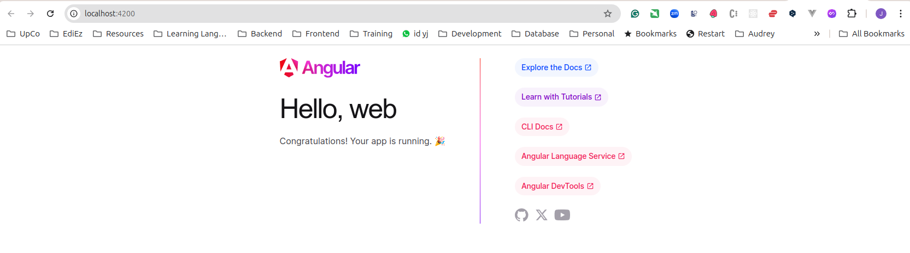

#### 3.1.3 Migrating to use Yarn v4

- We are going to migrate Yarn to use the v4 by executing `yarn set version stable`.

```bash
juanpabloperez@jpp-PROX15-AMD:~/Training/AngularNestJS/angular-nest-openai/web$ yarn set version stable
➤ YN0000: You don't seem to have Corepack enabled; we'll have to rely on yarnPath instead
➤ YN0000: Downloading https://repo.yarnpkg.com/4.5.0/packages/yarnpkg-cli/bin/yarn.js
➤ YN0000: Saving the new release in .yarn/releases/yarn-4.5.0.cjs
➤ YN0000: Done with warnings in 0s 157ms
```

- We are going to ensure we are using the latest version of yarn by executing `yarn -v`.

```bash
juanpabloperez@jpp-PROX15-AMD:~/Training/AngularNestJS/angular-nest-openai/web$ yarn -v
4.5.0
```

- We need to execute `yarn` to install the dependencies.

```bash
juanpabloperez@jpp-PROX15-AMD:~/Training/AngularNestJS/angular-nest-openai/web$ yarn
➤ YN0087: Migrated your project to the latest Yarn version 🚀

➤ YN0000: · Yarn 4.5.0
➤ YN0000: ┌ Resolution step
➤ YN0085: │ + @angular-devkit/build-angular@npm:18.2.8, @angular/animations@npm:18.2.8, @angular/cli@npm:18.2.8, and 950 more.
➤ YN0000: └ Completed in 2s 222ms
➤ YN0000: ┌ Fetch step
➤ YN0013: │ 354 packages were added to the project (+ 142.9 MiB).
➤ YN0000: └ Completed in 2s 482ms
➤ YN0000: ┌ Link step
➤ YN0007: │ esbuild@npm:0.23.0 must be built because it never has been before or the last one failed
➤ YN0007: │ esbuild@npm:0.21.5 must be built because it never has been before or the last one failed
➤ YN0007: │ nice-napi@npm:1.0.2 must be built because it never has been before or the last one failed
➤ YN0007: │ msgpackr-extract@npm:3.0.3 must be built because it never has been before or the last one failed
➤ YN0007: │ lmdb@npm:3.0.13 must be built because it never has been before or the last one failed
➤ YN0000: └ Completed in 5s 813ms
➤ YN0000: · Done in 10s 714ms
```

- We are going to ensure the Web project is still working by executing `ng serve`.

```bash
juanpabloperez@jpp-PROX15-AMD:~/Training/AngularNestJS/angular-nest-openai/web$ ng serve
Initial chunk files | Names         |  Raw size
polyfills.js        | polyfills     |  90.20 kB | 
main.js             | main          |  22.69 kB | 
styles.css          | styles        |  95 bytes | 

                    | Initial total | 112.98 kB

Application bundle generation complete. [1.324 seconds]

Watch mode enabled. Watching for file changes...
NOTE: Raw file sizes do not reflect development server per-request transformations.
Re-optimizing dependencies because lockfile has changed
  ➜  Local:   http://localhost:4200/
  ➜  press h + enter to show help
```

### 3.2. Create structure for the Angular project

#### 3.2.1. Creating the folders

- We are going to create the following folders in the `web/src/app` folder:

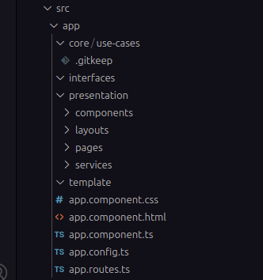

#### 3.2.2. Creating the `environments` documents

- We are going to create the `environments` document using `ng g environments`.

```bash
juanpabloperez@jpp-PROX15-AMD:~/Training/AngularNestJS/angular-nest-openai/web$ ng g environments
CREATE src/environments/environment.ts (31 bytes)
CREATE src/environments/environment.development.ts (31 bytes)
UPDATE angular.json (3496 bytes)
```

### 3.2.3. Installing `TailwindCSS` with `Angular`

- We are going to install `TailwindCSS` with `Angular` by following the instructions in [TailwindCSS: Angular](https://tailwindcss.com/docs/guides/angular).

- We need to install `TailwindCSS` and `PostCSS` by executing `yarn add tailwindcss postcss autoprefixer`.

```bash
uanpabloperez@jpp-PROX15-AMD:~/Training/AngularNestJS/angular-nest-openai/web$ yarn add -D tailwindcss postcss autoprefixer
➤ YN0000: · Yarn 4.5.0
➤ YN0000: ┌ Resolution step
➤ YN0085: │ + tailwindcss@npm:3.4.14, @alloc/quick-lru@npm:5.2.0, any-promise@npm:1.3.0, arg@npm:5.0.2, camelcase-css@npm:2.0.1, and 19 more.
➤ YN0000: └ Completed in 0s 581ms
➤ YN0000: ┌ Fetch step
➤ YN0013: │ 2 packages were added to the project (+ 6.17 MiB).
➤ YN0000: └ Completed in 0s 679ms
➤ YN0000: ┌ Link step
➤ YN0000: └ Completed in 0s 421ms
➤ YN0000: · Done in 1s 866ms
```

- We need to initialize `TailwindCSS` by executing `npx tailwindcss init`.

```bash
juanpabloperez@jpp-PROX15-AMD:~/Training/AngularNestJS/angular-nest-openai/web$ npx tailwindcss init

Created Tailwind CSS config file: tailwind.config.js
```

- We need to update the `tailwind.config.js` file to include the `purge` option.

```javascript
/** @type {import('tailwindcss').Config} */
module.exports = {
  content: [
    "./src/**/*.{html,ts}",
  ],
  theme: {
    extend: {},
  },
  plugins: [],
}
```

- We need to update the global styles in the `styles.css` file to include the `@tailwind` directives.

> angular-nest-openai/web/src/styles.css
```css
@tailwind base;
@tailwind components;
@tailwind utilities;
```

- Replace the content of the `app.component.html` file with specific `TailwindCSS` code.

> angular-nest-openai/web/src/app/app.component.html
```html
<h1 class="text-3xl font-bold underline">
  Hello world!
</h1>
```

- If we start the Angular project by executing `yarn start` we can see the `Hello world!` with the `TailwindCSS` styles.

```bash
uanpabloperez@jpp-PROX15-AMD:~/Training/AngularNestJS/angular-nest-openai/web$ yarn start
Initial chunk files | Names         | Raw size
polyfills.js        | polyfills     | 90.20 kB | 
styles.css          | styles        |  5.80 kB | 
main.js             | main          |  1.54 kB | 

                    | Initial total | 97.54 kB

Application bundle generation complete. [1.291 seconds]

Watch mode enabled. Watching for file changes...
NOTE: Raw file sizes do not reflect development server per-request transformations.
  ➜  Local:   http://localhost:4200/
  ➜  press h + enter to show help
```

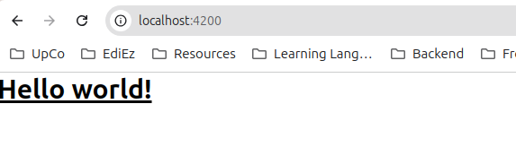

### 3.2.4 Creating the main pages

#### 3.2.4.1 Creating the `layout` component

- We are going to create the `layout` component by using `Angular Schematics: Generate a file from VSCode`.

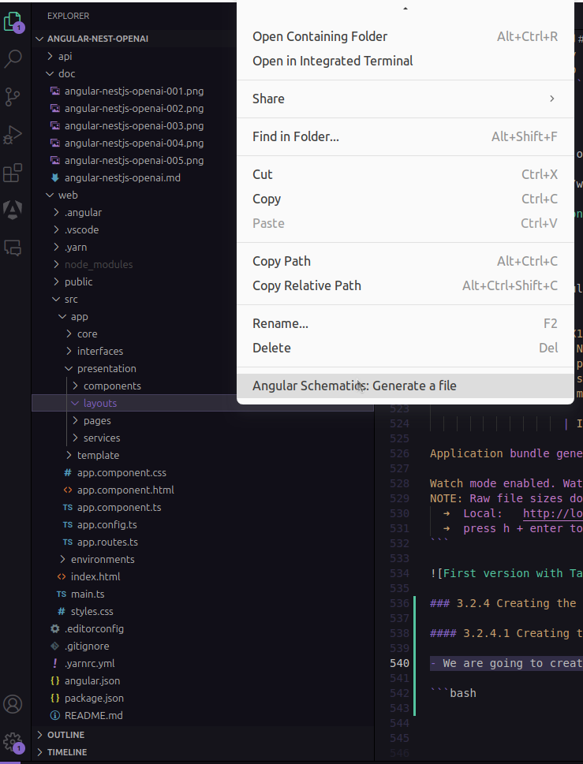

- We select `Component`

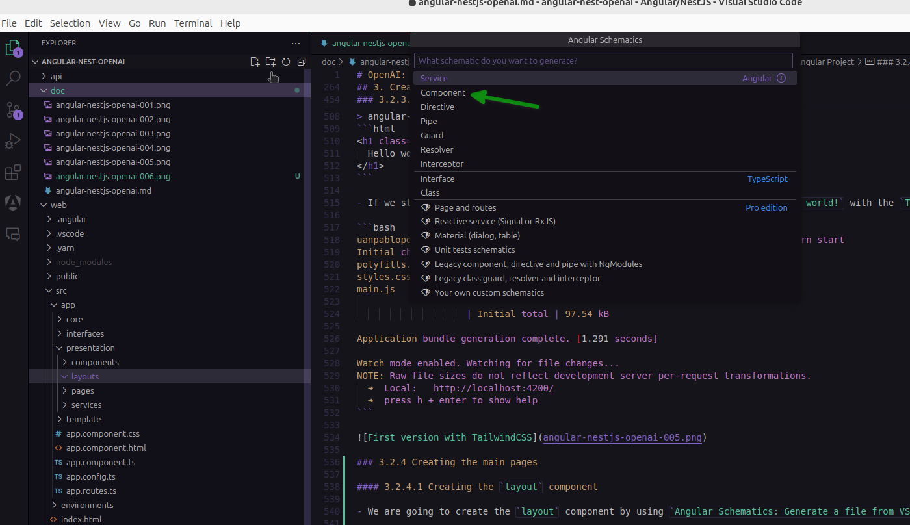


- Put `dashboard-layer` as the name of the component

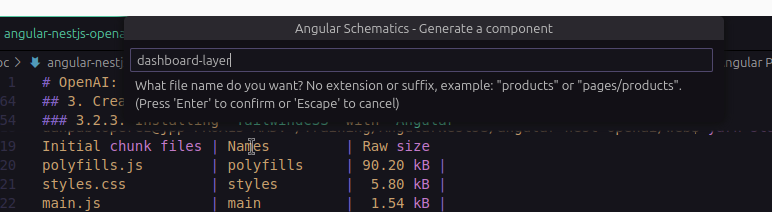

- We need to import the `CommonModule` in the `dashboard-layer.module.ts` file.

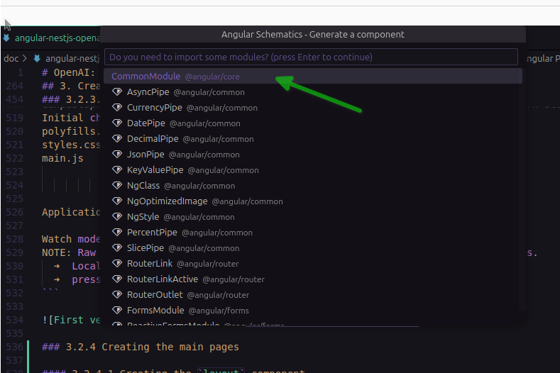

- We are going to set up a configuration for components in the future. We need to select `Advanced options`

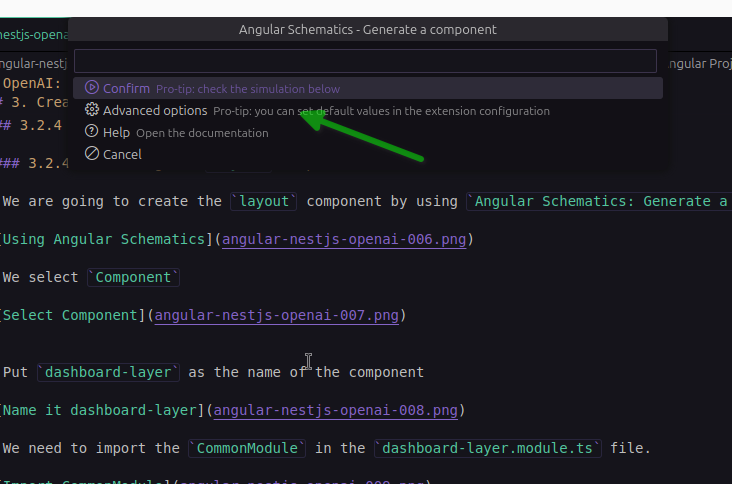

- We need to check the `externalTemplate` option.

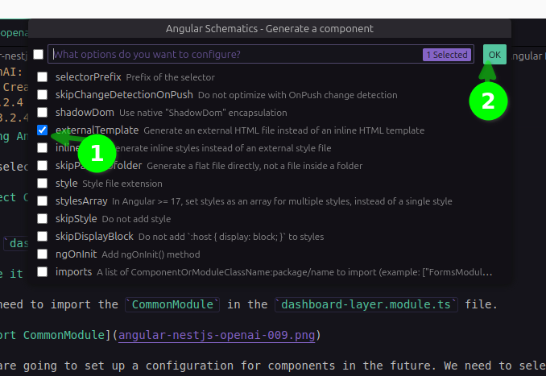

- We are going to select `Enable, and set as feault for this workspace folder`.

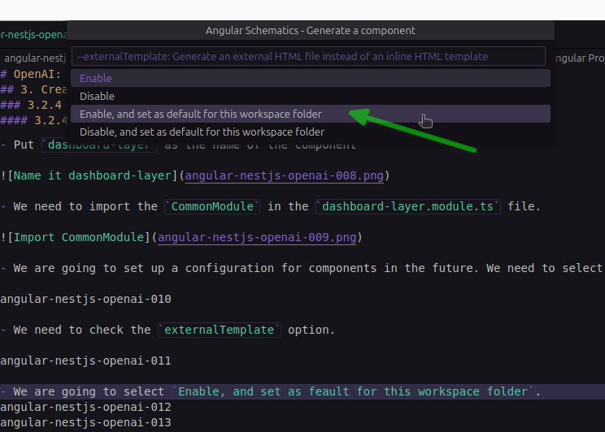

- We need to `Confirm` the changes.

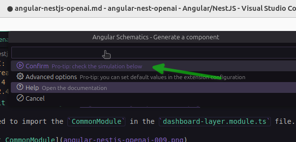

- It has generated the `dashboard-layer` component.

```bash
Generation result:
Destination path: web/src/app/presentation/layouts/dashboard-layer
File name: dashboard-layer.component
Schematic: Component (Angular)
Options: --style css --imports CommonModule:@angular/common --externalTemplate
CREATE web/src/app/presentation/layouts/dashboard-layer/dashboard-layer.component.ts
CREATE web/src/app/presentation/layouts/dashboard-layer/dashboard-layer.component.html
CREATE web/src/app/presentation/layouts/dashboard-layer/dashboard-layer.component.css
UPDATE web/src/app/presentation/layouts/dashboard-layer/dashboard-layer.component.ts
```

> web/src/app/presentation/layouts/dashboard-layer/dashboard-layer.component.ts
```typescript
import { CommonModule } from "@angular/common";
import { ChangeDetectionStrategy, Component } from '@angular/core';

@Component({
    selector: 'app-dashboard-layer',
    standalone: true,
    imports: [
        CommonModule,
    ],
    templateUrl: './dashboard-layer.component.html',
    styleUrl: './dashboard-layer.component.css',
    changeDetection: ChangeDetectionStrategy.OnPush,
})
export class DashboardLayerComponent { }
```

> Note: `changeDetection: ChangeDetectionStrategy.OnPush` is used when we use `Signals`.
> `CommonModule` is used to use the `ngIf` and `ngFor` directives.

- We are going to use `Angular Schematic` to create the `pages components`.

1. web/src/app/presentation/pages/assistant-page/assistant-page.component.ts
2. web/src/app/presentation/pages/audio-to-text-page/audio-to-text-page.component.ts
3. web/src/app/presentation/pages/image-generation-page/image-generation-page.component.ts
4. web/src/app/presentation/pages/image-tunning-page/image-tunning-page.component.ts
5. web/src/app/presentation/pages/orthography-page/orthography-page.component.ts
6. web/src/app/presentation/pages/pros-cons-page/pros-cons-page.component.ts
7. web/src/app/presentation/pages/pros-cons-stream-page/pros-cons-stream-page.component.ts
8. web/src/app/presentation/pages/text-to-audio-page/text-to-audio-page.component.ts
9. web/src/app/presentation/pages/translate-page/translate-page.component.ts

### 3.2.5 Creating the `Routes` for the main pages

- We need to update the `app.routes.ts` file to include the routes for the main pages.
- We can copy the content from the resource file.

> web/src/app/app.routes.ts
```typescript
import { Routes } from '@angular/router';
import { DashboardLayoutComponent } from './presentation/layouts/dashboard-layout/dashboard-layout.component';

export const routes: Routes = [
  {
    path: '',
    component: DashboardLayoutComponent,
    children: [
      {
        path: 'orthography',
        loadComponent: () =>
          import(
            './presentation/pages/orthography-page/orthography-page.component'
          ),
        data: {
          icon: 'fa-solid fa-spell-check',
          title: 'Ortografía',
          description: 'Corregir ortografía',
        },
      },
      {
        path: 'pros-cons',
        loadComponent: () =>
          import('./presentation/pages/pros-cons-page/pros-cons-page.component'),
        data: {
          icon: 'fa-solid fa-code-compare',
          title: 'Pros & Cons',
          description: 'Comparar pros y contras',
        },
      },
      {
        path: 'pros-cons-stream',
        loadComponent: () =>
          import(
            './presentation/pages/pros-cons-stream-page/pros-cons-stream-page.component'
          ),
        data: {
          icon: 'fa-solid fa-water',
          title: 'Como stream',
          description: 'Con stream de mensajes',
        },
      },
      {
        path: 'translate',
        loadComponent: () =>
          import('./presentation/pages/translate-page/translate-page.component'),
        data: {
          icon: 'fa-solid fa-language',
          title: 'Traducir',
          description: 'Textos a otros idiomas',
        },
      },
      {
        path: 'text-to-audio',
        loadComponent: () =>
          import(
            './presentation/pages/text-to-audio-page/text-to-audio-page.component'
          ),
        data: {
          icon: 'fa-solid fa-podcast',
          title: 'Texto a audio',
          description: 'Convertir texto a audio',
        },
      },
      {
        path: 'audio-to-text',
        loadComponent: () =>
          import(
            './presentation/pages/audio-to-text-page/audio-to-text-page.component'
          ),
        data: {
          icon: 'fa-solid fa-comment-dots',
          title: 'Audio a texto',
          description: 'Convertir audio a texto',
        },
      },
      {
        path: 'image-generation',
        loadComponent: () =>
          import(
            './presentation/pages/image-generation-page/image-generation-page.component'
          ),
        data: {
          icon: 'fa-solid fa-image',
          title: 'Imágenes',
          description: 'Generar imágenes',
        },
      },
      {
        path: 'image-tunning',
        loadComponent: () =>
          import(
            './presentation/pages/image-tunning-page/image-tunning-page.component'
          ),
        data: {
          icon: 'fa-solid fa-wand-magic',
          title: 'Editar imagen',
          description: 'Generación continua',
        },
      },

      {
        path: 'assistant',
        loadComponent: () =>
          import('./presentation/pages/assistant-page/assistant-page.component'),
        data: {
          icon: 'fa-solid fa-user',
          title: 'Asistente',
          description: 'Información del asistente',
        },
      },
      {
        path: '**',
        redirectTo: 'orthography',
        pathMatch: 'full',
      },
    ],
  },
];
```

## 4.- Setting Up the API NestJS Project with OpenAI

### 4.1 Updating the API NestJS project

#### 4.1.1 Installing the `class-validator` and `class-transformer` packages

- We are going to install the `class-validator` and `class-transformer` packages to validate the data that the user sends to the API.

```bash
yarn add class-validator class-transformer
➤ YN0000: · Yarn 4.5.0
➤ YN0000: ┌ Resolution step
➤ YN0085: │ + class-transformer@npm:0.5.1, class-validator@npm:0.14.1, @types/validator@npm:13.12.2, libphonenumber-js@npm:1.11.12, and 1 more.
➤ YN0000: └ Completed in 0s 403ms
➤ YN0000: ┌ Post-resolution validation
➤ YN0002: │ api@workspace:. doesn't provide webpack (pee0a8), requested by ts-loader.
➤ YN0086: │ Some peer dependencies are incorrectly met by your project; run yarn explain peer-requirements <hash> for details, where <hash> is the six-letter p-prefixed code.
➤ YN0086: │ Some peer dependencies are incorrectly met by dependencies; run yarn explain peer-requirements for details.
➤ YN0000: └ Completed
➤ YN0000: ┌ Fetch step
➤ YN0013: │ 2 packages were added to the project (+ 8.18 MiB).
➤ YN0000: └ Completed in 0s 544ms
➤ YN0000: ┌ Link step
➤ YN0008: │ @nestjs/core@npm:10.4.4 [7473a] must be rebuilt because its dependency tree changed
➤ YN0000: └ Completed in 0s 982ms
➤ YN0000: · Done with warnings in 2s 77ms
```

#### 4.1.2 Modifying the `main.ts` file

- We need to enable `CORS` in the `NestJS` API to allow the `Angular` project to make requests to the API.

- This is the current version of "main.ts" file:

> api/src/main.ts
```typescript
import { NestFactory } from '@nestjs/core';
import { AppModule } from './app.module';
import { ValidationPipe } from '@nestjs/common';

async function bootstrap() {
  const app = await NestFactory.create(AppModule);
  app.useGlobalPipes(
    new ValidationPipe({
      whitelist: true,
      forbidNonWhitelisted: true,
    }),
  );  
  app.enableCors();
  const port = process.env.PORT || 3000;
  app.listen(port, () => {
    console.log(`Listening on port ${port}!`);
  });  
}
bootstrap();
```

#### 4.1.3 Creating the `OpenAI` service

- We are going to create the `OpenAI` service to interact with the `OpenAI` API.

```bash
nest g res gpt
? What transport layer do you use? REST API
? Would you like to generate CRUD entry points? No
CREATE src/gpt/gpt.controller.spec.ts (546 bytes)
CREATE src/gpt/gpt.controller.ts (198 bytes)
CREATE src/gpt/gpt.module.ts (234 bytes)
CREATE src/gpt/gpt.service.spec.ts (439 bytes)
CREATE src/gpt/gpt.service.ts (87 bytes)
UPDATE package.json (2078 bytes)
UPDATE src/app.module.ts (304 bytes)
✔ Packages installed successfully.
```

- It creates the `gpt` module, controller, and service.

#### 4.1.4 Obtaining the `OpenAI` API key

- We need to authenticate with [OpenAI](https://platform.openai.com/) and clicking on the `Login` button.
- We need to obtain the `OpenAI` API key by following the instructions in [OpenAI: API Key](https://platform.openai.com/api-keys), by clicking on the `+Create New Secret Key` button.


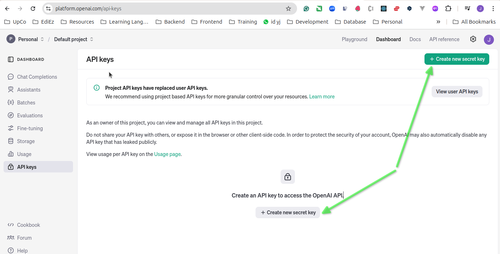

- We need to put `angular-nestjs-openai` as the name of the key and the click the `Create Secret Key` button.

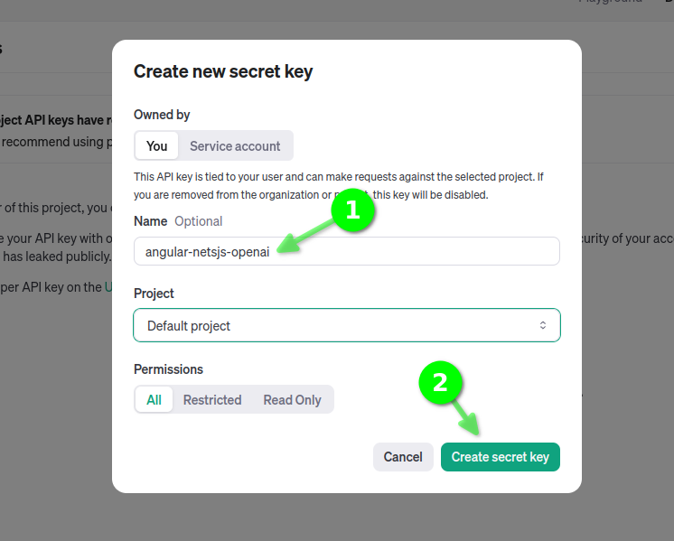

- We need to copy the `API Key` and save it in a safe place. Then, we need to close the dialog by clicking the `Done` button.

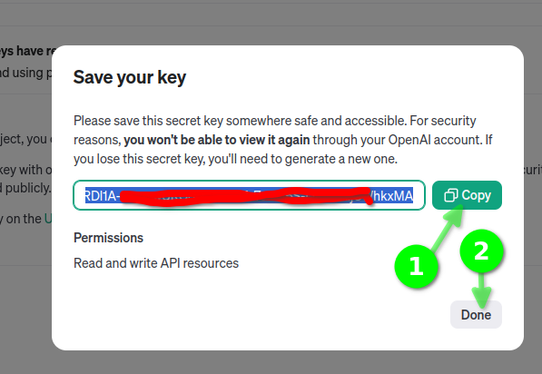

- We can see the `API Key` in the `OpenAI` dashboard.

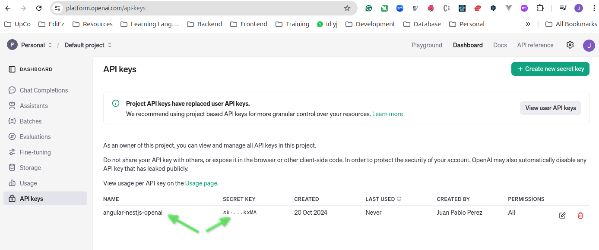

- We need to set up billing to use the `OpenAI` API. We need to go to [OpenAI Playground](https://platform.openai.com/playground/) and click on the `Finish Account Setup -->` button. 

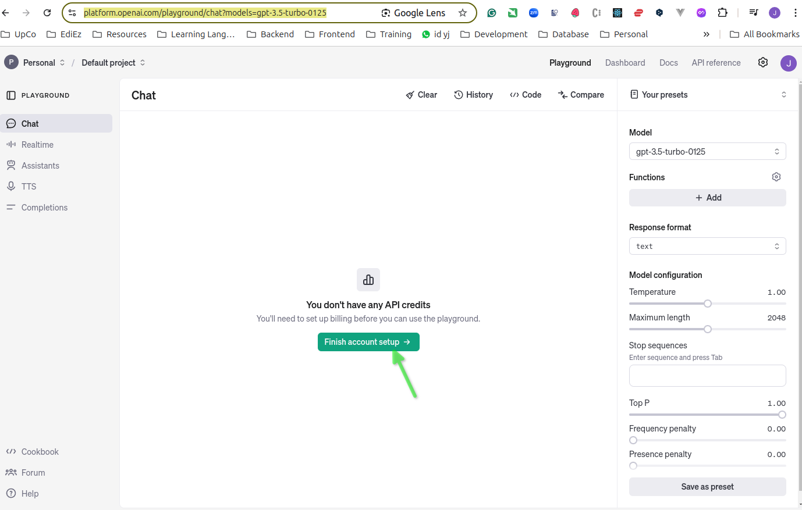

- We need to click on the `Add payment details` button and fill in the form with the payment details.

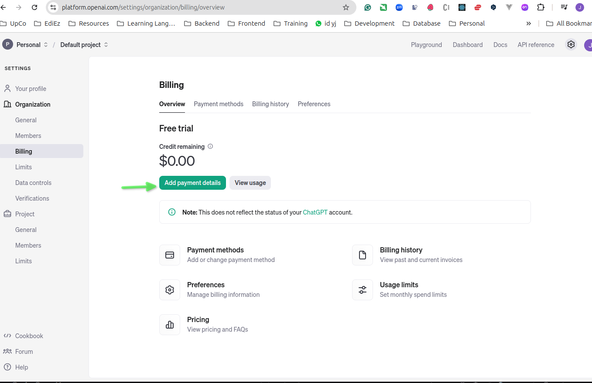

- We need to select the `Individual` option.

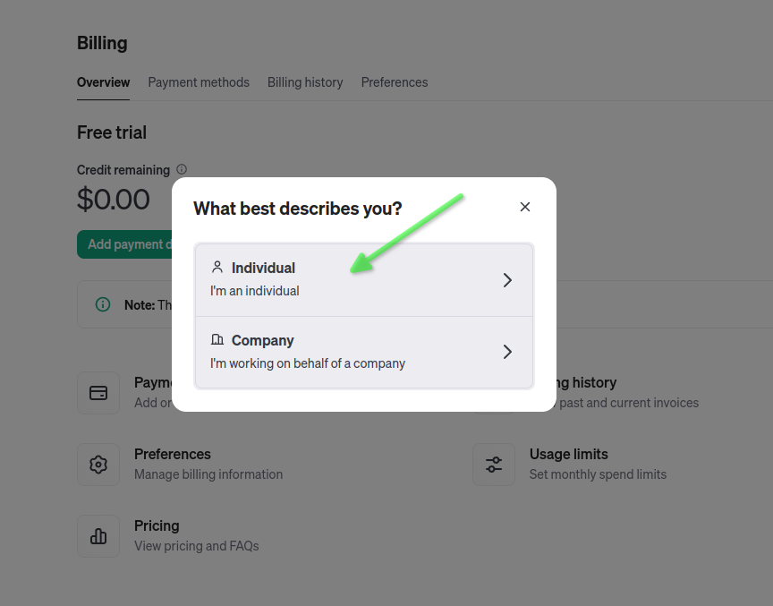

- We need to fill in the form with the payment details.

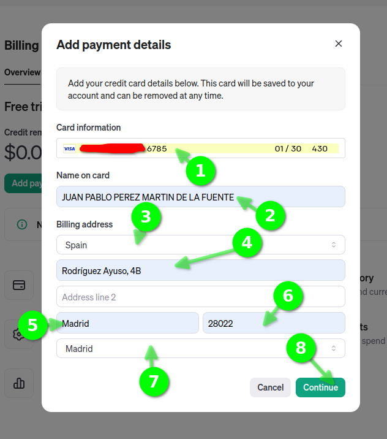

- We need to add an initial credit purchase and other values if we want to.

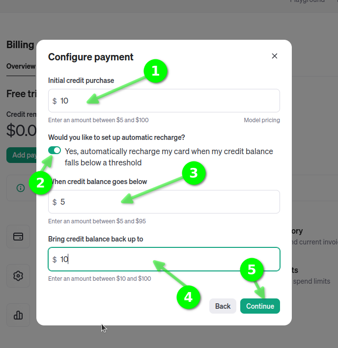

- We need to confirm the payment by clicking the `Confirm payment` button.

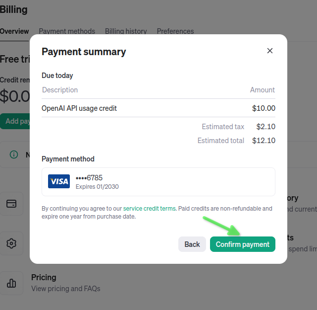

- We can see we have a credit of $10.00 in the `OpenAI` dashboard.

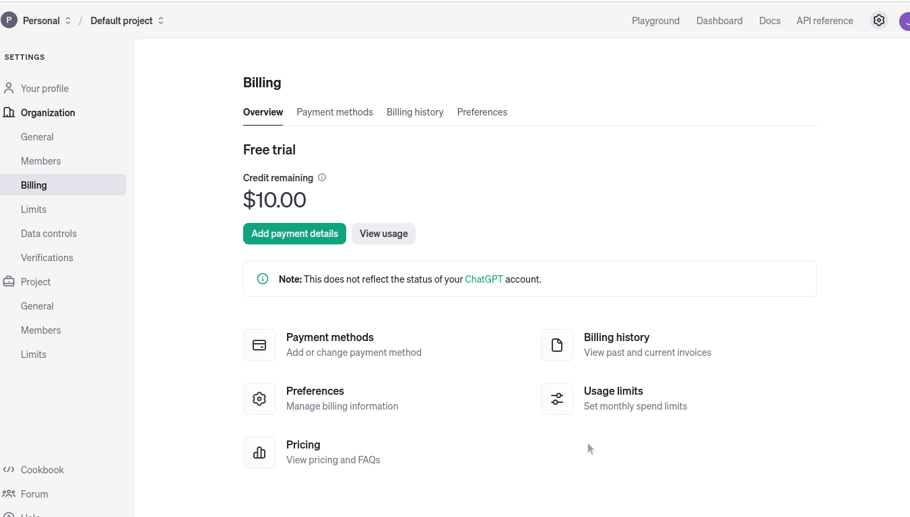

- We are going to create a `.env` file in the root of the `api` folder to store the `OpenAI` API key.
- We need to install `@nestjs/config` to use the `.env` file.

```bash
yarn add @nestjs/config
➤ YN0000: · Yarn 4.5.0
➤ YN0000: ┌ Resolution step
➤ YN0085: │ + @nestjs/config@npm:3.2.3, dotenv-expand@npm:10.0.0, dotenv@npm:16.4.5
➤ YN0000: └ Completed in 0s 235ms
➤ YN0000: ┌ Post-resolution validation
➤ YN0002: │ api@workspace:. doesn't provide webpack (pee0a8), requested by ts-loader.
➤ YN0086: │ Some peer dependencies are incorrectly met by your project; run yarn explain peer-requirements <hash> for details, where <hash> is the six-letter p-prefixed code.
➤ YN0086: │ Some peer dependencies are incorrectly met by dependencies; run yarn explain peer-requirements for details.
➤ YN0000: └ Completed
➤ YN0000: ┌ Fetch step
➤ YN0013: │ 2 packages were added to the project (+ 73.28 KiB).
➤ YN0000: └ Completed in 0s 408ms
➤ YN0000: ┌ Link step
➤ YN0007: │ @nestjs/core@npm:10.4.4 [7473a] must be built because it never has been before or the last one failed
➤ YN0000: └ Completed in 0s 715ms
➤ YN0000: · Done with warnings in 1s 531ms
```

- We need to modify the `app.module.ts` file to use the `ConfigModule` and the `.env` file.

> api/src/app.module.ts

```typescript
import { Module } from '@nestjs/common';
import { AppController } from './app.controller';
import { AppService } from './app.service';
import { GptModule } from './gpt/gpt.module';
import { ConfigModule } from '@nestjs/config';

@Module({
  imports: [GptModule, ConfigModule.forRoot()],
  controllers: [AppController],
  providers: [AppService],
})
export class AppModule {}
```

#### 4.1.5 Creating the `.env` file

- We need to create a `.env` file in the root of the `api` folder to store the `OpenAI` API key.

> api/.env
```env
# https://platform.openai.com/api-keys
OPENAI_API_KEY=your-openai-api-key
```

#### 4.1.6 Installing the `openai` package

- We are going to install the `openai` package to interact with the `OpenAI` API.

```bash
yarn add openai
➤ YN0000: · Yarn 4.5.0
➤ YN0000: ┌ Resolution step
➤ YN0085: │ + openai@npm:4.68.1
➤ YN0000: └ Completed in 0s 222ms
➤ YN0000: ┌ Post-resolution validation
➤ YN0002: │ api@workspace:. doesn't provide webpack (pee0a8), requested by ts-loader.
➤ YN0086: │ Some peer dependencies are incorrectly met by your project; run yarn explain peer-requirements <hash> for details, where <hash> is the six-letter p-prefixed code.
➤ YN0086: │ Some peer dependencies are incorrectly met by dependencies; run yarn explain peer-requirements for details.
➤ YN0000: └ Completed
➤ YN0000: ┌ Fetch step
➤ YN0013: │ A package was added to the project (+ 2.77 MiB).
➤ YN0000: └ Completed in 0s 439ms
➤ YN0000: ┌ Link step
➤ YN0000: └ Completed in 0s 485ms
➤ YN0000: · Done with warnings in 1s 294ms
```

### 4.1.8 Creating the `OpenAI` service and controller

- We are going to create the first dto to interact with the `OpenAI` API.

> api/src/gpt/dtos/orthography.dto.ts
```typescript
import { IsInt, IsOptional, IsString } from 'class-validator';

export class OrthographyDto {

  @IsString()
  readonly prompt: string

  @IsInt()
  @IsOptional()
  readonly maxTokens?: number;
}
```

- We are going to create the first Use Case to interact with the `OpenAI` API.

> api/src/gpt/use-cases/orthography.use-case.ts
```typescript
import { Logger } from '@nestjs/common';
import OpenAI from 'openai';

interface Options {
  prompt: string;
}

export const orthographyCheckUseCase = async (openai: OpenAI, options: Options) => {

  const logger = new Logger(orthographyCheckUseCase.name);

  const { prompt } = options;

  const completion = await openai.chat.completions.create({
    messages: [
      {
        role: "system",
        content: `
        Te serán proveídos textos en español con posibles errores ortográficos y gramaticales,
        Las palabras usadas deben de existir en el diccionario de la Real Academia Española,
        Debes de responder en formato JSON, 
        tu tarea es corregirlos y retornar información soluciones, 
        también debes de dar un porcentaje de acierto por el usuario,
        
        Si no hay errores, debes de retornar un mensaje de felicitaciones.

        Ejemplo de salida:
        {
          userScore: number,
          errors: string[], // ['error -> solución']
          message: string, //  Usa emojis y texto para felicitar al usuario
        }
        `
      },
      {
        role: 'user',
        content: prompt,
      }
    ],
    // model: "gpt-3.5-turbo-1106",
    model: "gpt-4o",
    temperature: 0.3,
    max_tokens: 150,
    top_p: 1,
    frequency_penalty: 0,
    presence_penalty: 0,
    response_format: {
      type: 'json_object'
    }
  });

  logger.debug(`Completion: ${JSON.stringify(completion)}`);
  const content = completion.choices[0].message.content;
  if (content === null) {
    throw new Error("Completion content is null");
  }
  const jsonResp = JSON.parse(content);

  return jsonResp;
}
```

- We are going to create the service to interact with the `OpenAI` API.

> api/src/gpt/gpt.service.ts
```typescript
import { Injectable } from '@nestjs/common';
import OpenAI from 'openai';
import { orthographyCheckUseCase } from './use-cases';
import { OrthographyDto } from './dtos';

@Injectable()
export class GptService {

  private openai = new OpenAI({
    apiKey: process.env.OPENAI_API_KEY,
  })

  // Solo va a llamar casos de uso
  async orthographyCheck(orthographyDto: OrthographyDto) {
    return await orthographyCheckUseCase(this.openai, {
      prompt: orthographyDto.prompt
    });
  }
}
```

- We are going to create the controller to interact with the `OpenAI` API.

> api/src/gpt/gpt.controller.ts
```typescript
import { Body, Controller, Post } from '@nestjs/common';
import { GptService } from './gpt.service';
import { OrthographyDto } from './dtos';

@Controller('gpt')
export class GptController {

  constructor(private readonly gptService: GptService) { }

  @Post('orthography-check')
  orthographyCheck(
    @Body() orthographyDto: OrthographyDto,
  ) {
    return this.gptService.orthographyCheck(orthographyDto);
  }
}
```

- We need to update the `gpt.module.ts` file to include the `GptController` and `GptService`.

> api/src/gpt/gpt.module.ts
```typescript
import { Module } from '@nestjs/common';
import { GptService } from './gpt.service';
import { GptController } from './gpt.controller';

@Module({
  controllers: [GptController],
  providers: [GptService],
})
export class GptModule {}
```

### 4.1.9 Testing the API NestJS project

- We need to install the `REST Client` extension in `VSCode` to test the API.
- Once we have installed the `REST Client` extension we can create a new file called `gpt.http` in the `api/src/gpt` folder.


> api/src/gpt/gpt.http
```http
## Local url
@url = http://localhost:3000/gpt

### Create a new payment intent
POST {{url}}/orthography-check
content-type: application/json

{
  "prompt": "Las casa son mui bonitas"
}
```

- If we execute that `POST` request we can see the response from the `OpenAI` API.

```http
HTTP/1.1 201 Created
X-Powered-By: Express
Access-Control-Allow-Origin: *
Content-Type: application/json; charset=utf-8
Content-Length: 152
ETag: W/"98-MVQZfGr2h0wLhUlrBs9VhJHQ8A4"
Date: Sun, 20 Oct 2024 18:59:43 GMT
Connection: close

{
  "userScore": 66.67,
  "errors": [
    "Las casa -> Las casas",
    "mui -> muy"
  ],
  "message": "¡Buen intento! 😊 Sigue practicando para mejorar tu ortografía. 📚"
}
```

- We can also see the log on the console:

```txt
Nest] 44614  - 20/10/2024, 19:59:43   DEBUG [orthographyCheckUseCase] Completion: {"id":"chatcmpl-AKVROvibO5EEQQkZ7hrhrclwhJghv","object":"chat.completion","created":1729450782,"model":"gpt-4o-2024-08-06","choices":[{"index":0,"message":{"role":"assistant","content":"{\n  \"userScore\": 66.67,\n  \"errors\": [\n    \"Las casa -> Las casas\",\n    \"mui -> muy\"\n  ],\n  \"message\": \"¡Buen intento! 😊 Sigue practicando para mejorar tu ortografía. 📚\"\n}","refusal":null},"logprobs":null,"finish_reason":"stop"}],"usage":{"prompt_tokens":151,"completion_tokens":55,"total_tokens":206,"prompt_tokens_details":{"cached_tokens":0},"completion_tokens_details":{"reasoning_tokens":0}},"system_fingerprint":"fp_45c6de4934"}
```